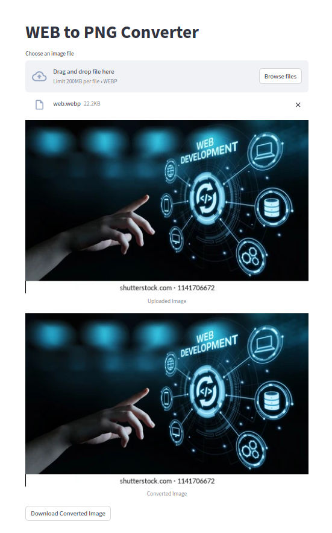

Web Interface:

Users access the tool through a web interface served by the Flask application.
The interface includes a form with a file input, allowing users to select a WebP image file for conversion.
Conversion Process:

When a user submits a WebP image file through the form, the application checks if the file is a valid WebP format.
If valid, the application converts the WebP image to the PNG format using the Python Imaging Library (PIL) and saves the converted image to a temporary file.
User Interaction:

After conversion, the application presents the user with the converted image on the web interface.
Users can choose to download the converted PNG image by clicking the "Download" button.
Download Functionality:

The "Download" button triggers the Flask route /download, which sends the converted PNG image file to the user's browser as a downloadable attachment.
File Handling and Cleanup:

Temporary files are used to store the converted image, and these files are cleaned up periodically to manage storage space.
Error Handling:

The program checks for potential errors, such as invalid file formats, and provides appropriate feedback to the user.
Dependencies:

The program utilizes Flask as the web framework and PIL (Pillow) for image processing.
Overall, the program offers a straightforward and user-friendly interface for converting WebP images to PNG format, enhancing the accessibility and usability of images across different platforms and applications.

https://huggingface.co/spaces/razaAhmed/WebtoPng